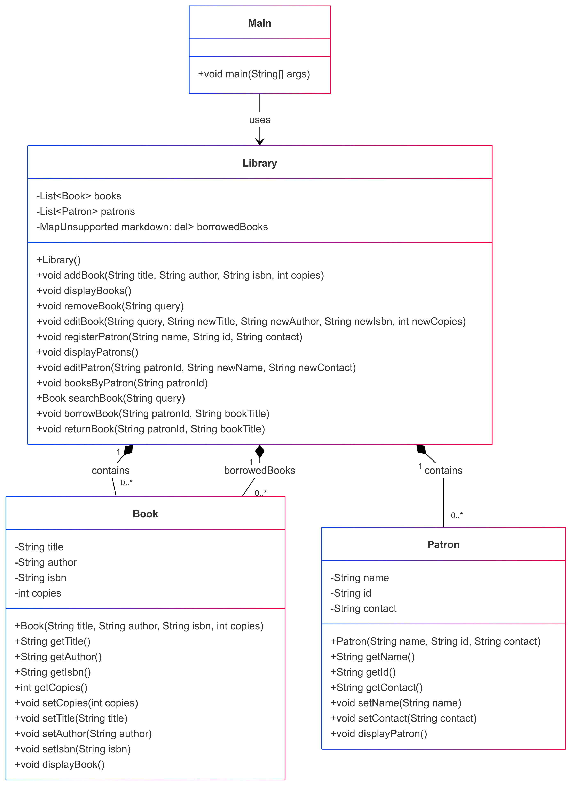

# Library Management System

Este programa es un sistema de gestión de bibliotecas simple desarrollado en Java. Permite a los usuarios gestionar libros y usuarios (patrones) en una biblioteca. El sistema ofrece funcionalidades como agregar, editar, eliminar y mostrar libros, así como registrar, editar y mostrar usuarios. Además, los usuarios pueden prestar y devolver libros.

## Características principales

- **Gestión de libros**:
  - Agregar nuevos libros con título, autor, ISBN y número de copias.
  - Mostrar todos los libros disponibles.
  - Editar la información de un libro existente.
  - Eliminar un libro de la biblioteca.

- **Gestión de usuarios (patrones)**:
  - Registrar nuevos usuarios con nombre, ID y contacto.
  - Mostrar todos los usuarios registrados.
  - Editar la información de un usuario existente.

- **Préstamo y devolución de libros**:
  - Los usuarios pueden prestar libros si hay copias disponibles.
  - Los usuarios pueden devolver libros prestados.

- **Visualización de libros prestados**:
  - Mostrar los libros que un usuario específico ha prestado.

## Diagrama de clases

A continuación se muestra el diagrama de clases del sistema:



## Cómo usar el programa

1. **Compilar y ejecutar**:
   - Asegúrate de tener Java instalado en tu sistema.
   - Compila los archivos `.java` usando el siguiente comando:
     ```bash
     javac Main.java Book.java Patron.java Library.java
     ```
   - Ejecuta el programa con:
     ```bash
     java Main
     ```

## Estructura del código

El programa está compuesto por las siguientes clases:

- **Main**: Contiene el método `main` que maneja la interacción con el usuario y llama a los métodos de la clase `Library`.
- **Library**: Gestiona la lista de libros y usuarios, y maneja las operaciones como agregar, eliminar, editar, prestar y devolver libros.
- **Book**: Representa un libro con atributos como título, autor, ISBN y número de copias.
- **Patron**: Representa un usuario (patrón) con atributos como nombre, ID y contacto.